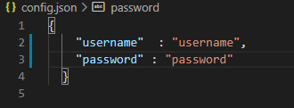

# SteamRecentActivityHours
Launches all steam games and apps for farming Activity Hours on profile.

Script i just made in node.js to launch all games and apps in steam libray, results farming Activity Hours on Steam profile (1000+ Hours in a 3 days)

Make sure you installed steam-user from npm.

Start with command "node ." or "node activity.js"

Edit the config, set up your username and password

Like this

PLEASE Read LICENSE File.

If this script is buggy, not my fault
